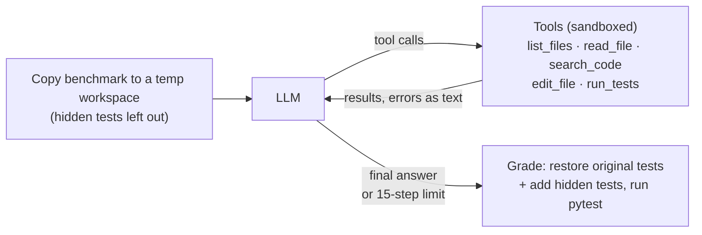

# BugSquad

An AI agent that fixes bugs in small Python projects, and an evaluation harness that checks whether the bugs are *really* fixed.

The agent reads a bug report, explores the code, runs the tests, makes a minimal edit and verifies its own fix. Every run is then graded with **hidden tests the agent never sees**, so a fix only counts if it solves the problem, not just the visible tests.

The agent loop is written from scratch (no LangChain or similar framework) on top of an OpenAI-compatible API, and currently runs on Google Gemini.

```text
$ bugsquad benchmarks/010_misleading_issue

=== Changes ===
--- a/parsing.py
+++ b/parsing.py
-    return float(text.replace(",", "."))
+    return float(text.replace(".", "").replace(",", "."))

Independent check: STATUS: PASSED (exit code 0)
finished=True  steps=9  tokens=9741+833  cost=$0.0104
```

## Results

17 benchmark cases at four difficulty levels, each run 3 times (51 runs), with `gemini-3.5-flash-lite`:

| Difficulty | Solved | Avg steps | Avg cost per run |
|---|---|---|---|
| Easy | 12/12 | 7.8 | $0.0029 |
| Medium | 12/12 | 7.2 | $0.0027 |
| Hard | 12/12 | 9.3 | $0.0040 |
| Expert | 15/15 | 11.5 | $0.0067 |
| **Total** | **51/51** | **9.1** | **$0.0042** |

Raw results for every run are in [`results/`](results/). Costs use the list prices at the time of the run.

These numbers did not start at 100%. How they got there is the more interesting part (see [What the evaluation taught me](#what-the-evaluation-taught-me)).

## How it works



1. **Workspace.** The benchmark is copied to a fresh temp folder. Hidden tests are never copied, and a check stops the run if they ever leak in.
2. **Agent loop.** The model gets a system prompt, the task ("fix the bug described in issue.md") and five tools. Each step, the whole conversation is sent to the model; it either requests tool calls or gives a final answer. The loop stops on a final answer or after 15 steps.
3. **Grading.** After the agent finishes, the original visible tests are restored (in case they were changed), the hidden tests are added, and everything runs together. Only this result counts as "solved".

### Tools

| Tool | What it does |
|---|---|
| `list_files` | Lists project files, skipping caches and virtualenvs |
| `read_file` | Reads a file, 300 lines at a time, with a hint on how to continue |
| `search_code` | Plain-text search across files, returns `path:line: text` |
| `edit_file` | Replaces one exact, unique snippet. Test files are read-only |
| `run_tests` | Runs pytest with a timeout and returns a short status plus output |

## Benchmarks

| Level | Cases | What makes them hard |
|---|---|---|
| Easy | 001–004 | Single file, the bug is where the issue points |
| Medium | 005–008 | Logic errors that need the code to be understood |
| Hard | 009–012 | Bug in a helper module, a misleading issue, class state, two bugs at once |
| Expert | 013–017 | 15-file project with decoy files, a file too long to read at once, a fix that breaks another caller, visible tests that already pass, a unit mismatch across layers |

Each case has an `issue.md`, the buggy code, visible tests and `hidden/test_hidden.py`. Hidden tests use different inputs, so hard-coding answers for the visible tests fails. For the trap cases, the obvious wrong fix makes the visible tests pass and is caught by the hidden ones.

## What the evaluation taught me

**1. The first benchmark was too easy.** The first version (001–012) scored 36/36 with `gemini-3.8-flash`. A cheaper model, `gemini-3.5-flash-lite`, also scored 36/36 at about a third of the cost ($0.0027 vs $0.0074 per run). A perfect score said nothing about where the agent struggles, so I added an expert level.

**2. A failure that wasn't the model's fault.** On the expert set the agent scored 12/15. All three failures were the long-file case: `read_file` cut files at 20,000 characters, and the buggy function was past that point. Instead of saying it couldn't see the code, the agent *invented* what the function probably looked like and tried to edit that, then re-read the same truncated file until it hit the step limit. Those three runs cost about 20x a normal run.

**3. Fixing the tool, not the prompt.** I changed `read_file` to work in line ranges with an explicit "call again with `start_line=301`" hint, and added `search_code`. The long-file case went from 0/3 to 3/3, and its cost per run dropped from $0.085 to $0.010. A full re-run showed no regressions. The agent only used `search_code` on the large or long-file cases, never on the small ones.

**4. Tools have a cost even when unused.** After adding `search_code`, the small cases got about 20% more expensive even though the agent never called it, because tool schemas are sent with every request.

**5. My own predictions were wrong.** Before running the expert set I wrote down what I expected. I predicted the agent would stop early when the visible tests already pass, and would fall for the misleading issue that blames a shared function. It did neither: it fixed the bug described in the issue even with green tests, and it checked the other caller of the shared function before editing.

## Design decisions

- **No agent framework.** The loop is about 50 lines. Writing it myself made every detail visible: for example, assistant messages with several parallel tool calls must be appended once, not once per call.
- **Errors are returned as text.** A wrong file name or an ambiguous edit returns a message that tells the model what to do next, instead of crashing the loop. Unexpected errors in my own code still crash, so bugs are not hidden.
- **Guarantees in code, not in the prompt.** The prompt asks the agent not to edit tests; `edit_file` enforces it. Paths are resolved and checked so the agent cannot read or write outside its workspace.
- **The agent never grades itself.** The final verdict comes from the harness, using test files the agent could not change or see.
- **Hard limits everywhere.** Step limit, test timeout, and caps on file, search and test output size.
- **No multi-agent setup.** I planned to split the agent into navigator, fixer and reviewer roles, but only after measuring where a single agent fails. After the tool fix it no longer failed anywhere in the benchmark, so adding agents would have added cost without a measurable gain.

## Limitations

- The benchmarks are small and synthetic. Real repositories are bigger, messier and have flaky tests.
- Protecting test files is a filename heuristic (`test_*.py`); it does not cover `conftest.py`. The final grading restores tests anyway, so this affects the agent's behavior, not the score.
- Read-only tests also block good behavior: on one case the agent tried to add a regression test and was refused. Allowing new test files while keeping existing ones read-only would fix this.
- 3 runs per case is enough to spot inconsistent cases, not to give tight confidence intervals.

## Quick start

Requires Python 3.10+.

```bash
git clone https://github.com/<your-username>/bugsquad.git
cd bugsquad
python -m venv .venv && source .venv/bin/activate
pip install -e ".[dev]"
cp .env.example .env    # then fill in the values below
```

`.env`:

```text
LLM_API_KEY=your-key
LLM_BASE_URL=https://generativelanguage.googleapis.com/v1beta/openai/
LLM_MODEL=gemini-3.5-flash-lite
LLM_INPUT_PRICE_PER_M=0.30
LLM_OUTPUT_PRICE_PER_M=2.50
```

Any OpenAI-compatible endpoint works (OpenAI, a local Ollama server, ...) by changing these values.

```bash
bugsquad benchmarks/009_bug_in_helper     # fix one bug and show the diff
bugsquad-eval --only 013 014 --runs 1     # evaluate a few cases
bugsquad-eval                             # full evaluation (17 cases x 3 runs)
pytest                                    # unit tests for the tools and registry
```

## Project layout

```text
src/bugsquad/
  llm.py         OpenAI-compatible client, model and retry settings
  tools.py       The five tools and the workspace sandbox
  registry.py    Tool schemas shown to the model and a safe dispatcher
  agent.py       The agent loop, step limit and token/cost tracking
  workspace.py   Temp copy of a benchmark without hidden tests
  cli.py         `bugsquad`: run the agent on one project and show the diff
  evaluate.py    `bugsquad-eval`: run, grade and summarize all benchmarks
benchmarks/      17 cases + manifest.json with difficulty levels
results/         Raw evaluation results used in this README
tests/           Unit tests for the tools and the registry
```

## Next steps

- Allow the agent to add new test files while keeping existing ones read-only.
- Try the harness on real bugs from open-source projects.
- A follow-up project: an agent that uses retrieval (RAG) to navigate much larger codebases.
